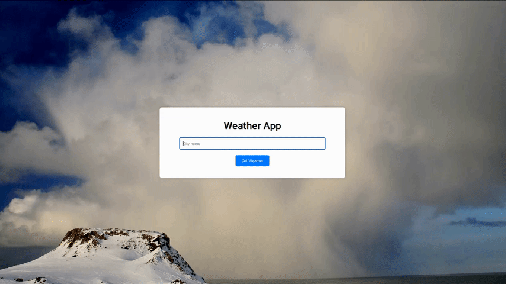

# Weather App 0.3.1

This is a simple Weather Application built using HTML, CSS, and JavaScript. It allows users to input a city name and get the current weather information for that city, including a brief weather description and the temperature. The app utilizes the OpenStreetMap Nominatim API for geocoding and the Met.no Weather API for fetching weather data.

## GIF Animation



## Features

- User-friendly interface for inputting a city name and retrieving weather data.
- Responsive design that adapts to different screen sizes.
- Fetches weather data using a proxy to avoid CORS issues.
- Displays weather description with corresponding icons and current temperature.

## Technologies Used

- **HTML5**: For structuring the web page.
- **CSS3**: For styling the web page.
- **JavaScript**: For handling user input, fetching data from APIs, and dynamically updating the DOM.
- **OpenStreetMap Nominatim API**: For geocoding city names to coordinates.
- **Met.no Weather API**: For retrieving weather data based on coordinates.

## Usage

1. Clone the repository:
    ```bash
    git clone https://github.com/GxbrielZ/weather_app.git
    ```
2. Navigate to the project directory:
    ```bash
    cd weather-app
    ```
3. Open `index.html` in your web browser:
    ```bash
    open index.html
    ```

## How It Works

1. The user enters a city name into the input field and clicks the "Get Weather" button.
2. The app uses the OpenStreetMap Nominatim API to get the coordinates (latitude and longitude) of the city.
3. With the coordinates, the app fetches weather data from the Met.no Weather API using a proxy to bypass CORS restrictions.
4. The fetched weather data is then displayed on the page, including a weather icon and the current temperature.

## Acknowledgements

- [OpenStreetMap](https://www.openstreetmap.org/) for providing free geocoding services.
- [Met.no](https://www.met.no/en) for providing free weather data.